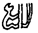
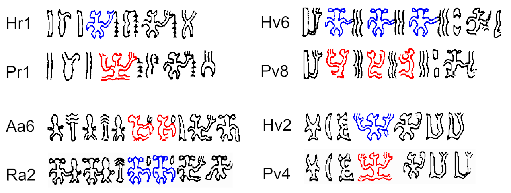

# Revising the glyph catalogue

A sound statistical analysis of RoR depends on the correct transliteration of the texts. Unfortunately, the system devised by Barthel (1958) exaggerates the quantity of glyphs by assigning different numbers to allographs and ligatures. In fact, a quick experiment showed me that, after differentiating the most obvious allographs and separating the most obvious ligatures (e.g. anthropomorphs and ornitomorphs with various hand shapes), we are left with about 50 glyphs accounting for over 90% of the corpus - a number surprisingly close to the number of Rapanui syllables.

Martha Macri (1996), the Pozdniakovs (<a href="http://pozdniakov.free.fr/publications/2007_Rapanui_Writing_and_the_Rapanui_Language.pdf">2007</a>) and Paul Horley (<a href="https://kahualike.manoa.hawaii.edu/rnj/vol19/iss2/6/">2005</a>) have all attempted to simplify Barthel's catalogue, arriving at pretty similar solutions. Horley offers the most radical restructuring, e.g. considering the anthropomorphic and ornitomorphic glyphs' heads as independent signs. For creating the "simplified" corpus, I mostly adopted the Pozdniakovs' solution, except for the treatment of glyphs like those in the series 420-430, which Pozdniakov (<a href="https://doi.org/10.4000/jso.6371">2011</a>) initially regarded as a ligature of hand glyphs 006 or 010 with anthropomorphic or ornitomorphic glyphs.

In fact, it is unclear how those glyphs should be treated. In a recent paper, Pozdniakov (<a href="http://pozdniakov.free.fr/publications/2016_Correlation_of_graphical_features.pdf">2016</a>) cast doubt on whether glyphs of the series 220/240/320/340 should be considered as independent glyphs rather than allographs of 200/300, based on the observation that leg shapes are not independent of hand shapes.

There are reasons to take that argument one step further and consider all anthropomorphic glyphs as allographs. The parallel passages below are striking:

Other examples can be found in Aa7:Ra3, Br9:Bv3, Bv3:Ra4, Bv8:Sa5, Bv7 and probably many other places.

If anthropomorphic glyphs in standing (200/300), seating in profile (280/380) and seating in frontal view (240/340) position are allographs, should we view ornitomorphic glyphs in the same manner? For example,  should we treat glyphs in the 430/630 series as "profile" versions of the frontal ornitomorphs (400/600)? Pozdniakov (<a href="http://pozdniakov.free.fr/publications/2016_Correlation_of_graphical_features.pdf">2016</a>) seems to hint at that possibility for glyphs in the 430 series, even suggesting that Barthel (1958) probably thought so. Here, I have adopted that view, merging all anthropomorphs and most ornitomorphs (except for those in the 660 series) in the "simplified" corpus.
