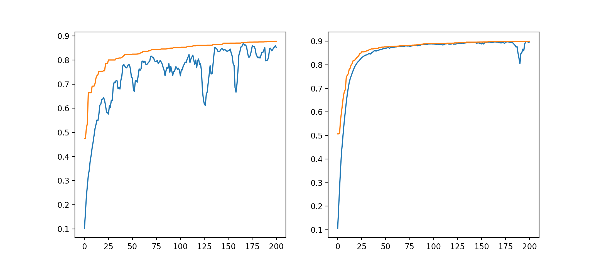

## A machine learning approach

Given a sufficiently long text written in an unknown script, decipherment is achievable - provided the underlying language and type of writing system are known.

Assuming that RoR is predominantly syllabic, as suggested by the glyph frequencies, one could employ a brute force approach and test different mappings of glyphs to syllables. The problem is one of verifyability - unless an entire text in clear, understandable Rapanui is produced, how to decide between different mappings? Indeed, this seems to be the favourite approach of many pseudo-decipherments, which eventually produce a few meaningful words but have to resort to implausible arguments to interpret longer passages.

How to decide on the plausibility of a deciphered text? Here, I employ a support vector machine (SVM) classifier and a recurrent neural network (RNN) to predict whether a text is viable Rapanui. I was inspired by Avi Banerjee's treatment of a similar problem - the <a href="https://github.com/CanonManF22/theZodiacKiller">Zodiac killer's cypher</a>.

Models are trained on a corpus of:

<ul>
<li>real Rapanui songs and poetry, assumed to be the genres most likely present in RoR;</li>
<li>pseudo-Rapanui verses created by randomly concatenating syllables; </li>
<li>pseudo-Rapanui verses created by encrypting the real verses with a substitution cypher (mapping to different syllables).</li>
</ul>

I originally included a fourth category created by shuffling the syllables of real Rapanui verses, but that somehow resulted in models that were difficult to train, so I left it out for now.

Since there is no separation of words in RoR, all the texts were converted into continuous syllables separated by spaces (just to facilitate tokenization). Texts were truncated to a maximum of 50 syllables (longer verses were split). In the case of the LSTM, preprocessing also involved padding to 50 tokens.

The absence of word separation is a major drawback that prevents, for example, the application of the model designed by Luo et al. (<a href="http://dx.doi.org/10.18653/v1/P19-1303">2019</a>), which depends on matching cognates at the word level.

### LinearSVC and LSTM

Initially, a Linear Support Vector Classification (SVC) model was trained on the corpus with real Rapanui and the two pseudo datasets using an <i>n</i>-ngram range of 2 to 3 syllables. The classification achieves a validation accuracy above 95%. However, a problem that I found when using LinearSVC with a language like Rapanui (which has a very limited phonological inventory) is that it is very prone to misclassifying random concatenations of syllables that eventually contain Rapanui words, but which don't make sense as a sentence. Increasing the <i>n</i>-gram range did not solve this issue.

Because the order in which words occur is crucial for deciding whether a sentence is valid Rapanui (beyond the mere frequency of <i>n</i>-grams), a potential solution is to train a Long Short-Term Memory (LSTM) network. The network has an embedding layer of size 32, a bidirectional LSTM layer of size 64, a dropout of 20% and a dense output layer of size 3 (real Rapanui and the two pseudo-corpora) with softmax activation. Other architectures are possible, but out of the ones I tried, this yielded the highest validation accuracy (70-80%).

I used sklearn for the LinearSVC and tensorflow for the LSTM. Models can be loaded from the <code>models</code> folder.

### Genetic algorithm

Every genome in the population is a sequence of syllables to be matched with the top 50 most frequent glyphs (ordered). I tested two methods: (1) initializing every genome to a different, random sequence, and (2) initializing every genome with the same sequence - ordered by the actual Rapanui syllable frequencies. I thought the latter could speed up the process, as a mapping that resulted in too different a syllable frequency from the actual language should score pretty low anyway.

Because order is meaningful, I experimented with two different crossover methods - ordered crossover (OX1) and edge recombination crossover (ERX). Mutation involves swapping two random syllables. Originally, when initializing genomes based on the Rapanui syllable frequencies, I thought it was a good idea to only swap the syllables in immediate vicinity - but since OX1 and ERX were doing something similar, I reserved mutations for more drastic changes.

Every genome (map of glyphs to syllables) is evaluated by decoding the selected RoR corpus and getting a mean of the scores of the LSTM and LinearSVC on the decoded text. In essence, the more Rapanui-like the decoded text, the higher the score should be. The text is split when unmapped glyphs are encountered (another solution could be mapping them to OOV), resulting in various lines. Those longer than 10 syllables are scored by the LSTM/LinearSVC, the final score of each model being an average of all decoded lines. There certainly are better procedures to get the fitness of a decoded text - this was just a quick solution.

The genetic algorithm was run for 200 generations with a population of 500 genomes, 200 parents, 50 elite genomes and probabilities of crossover and mutation of 0.8 and 0.1 respectively. The graphs below show the maximum (orange) and average (blue) scores of the population (randomly initialized) when using ERX (left) and OX1 (right). One can see that the latter results in less drastic recombination, and thus in lower diversity. Maximum scores reach nearly 90% in both cases.

