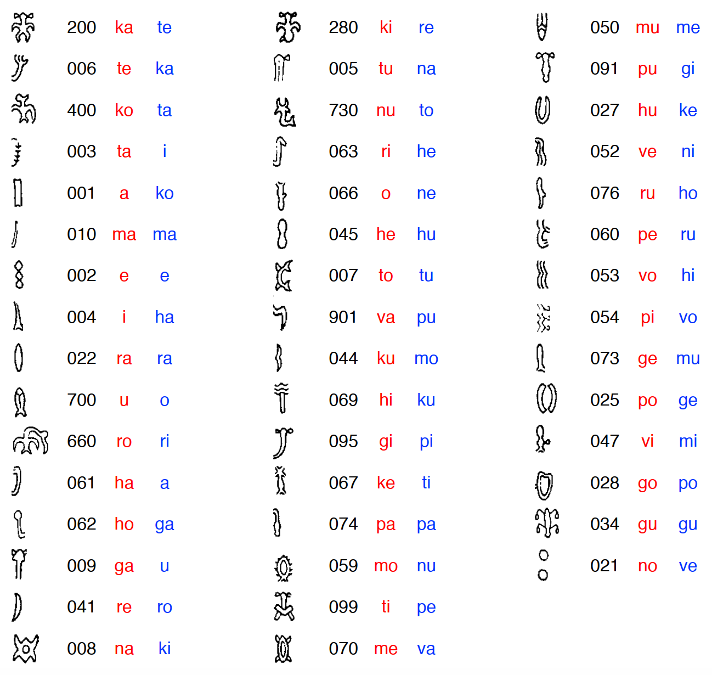

## Results

I was astonished to find that, even when all genomes are randomly initialized, the final keys of the best-performing models are similar. The following values are consistently selected by the top 10 best-performing (and non-identical) genomes of each run (among a total of 4 runs using a combination of genomes initialized by frequency vs. randomly and crossovers by ERX vs. OX1):

Interestingly, some of those values have been proposed before. For example, readings of 200 as <i>te</i> and 002 as <i>a</i> have been suggested by Horley (<a href="https://kahualike.manoa.hawaii.edu/rnj/vol19/iss2/6/">2005</a>) - although he saw the latter glyph as an allograph for the former's head (forming a frequent ligature that could be read as <i>tea</i>). The reading of 400 as <i>ta</i>, perhaps from the first syllable of <i>tavake</i> (sea bird), was proposed long ago by Guy (<a href="https://doi.org/10.3406/jso.1990.2882">1990</a>) based on the supposed spelling of one of the nights' names in the Mamari calendar.
