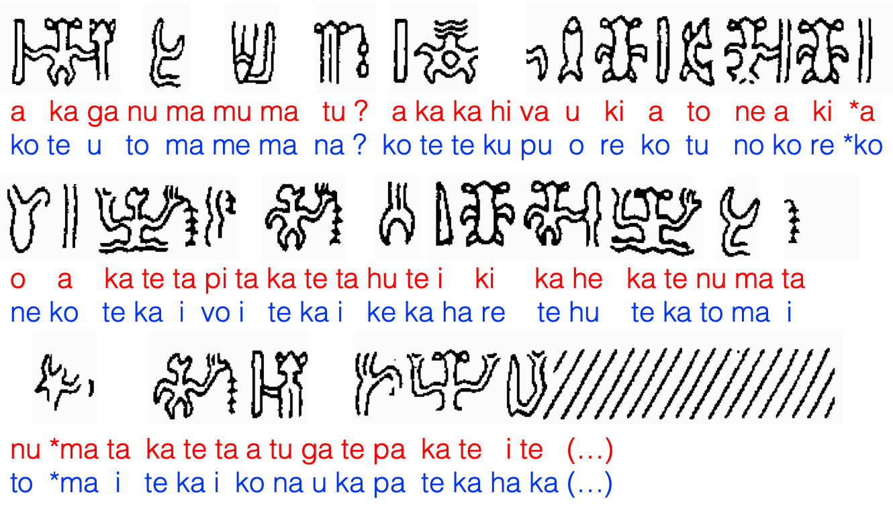

# Results

I was astonished to find that, even when all genomes are randomly initialized, the final keys of the best-performing models are similar. For example, the following values (glyphs ordered by frequency) have been selected by the best-performing genomes of two runs, using ERX (red) and OX1 (blue), both initialized randomly:

Notice that, even when different syllables are selected, the corresponding values tend to be close to each other in the sequence. That is because the best-performing models all converge towards producing syllable frequencies that approach those of actual Rapanui.

Interestingly, some of those values have been proposed before. For example, a reading of 200 as <i>te</i> has been suggested by Horley (<a href="https://kahualike.manoa.hawaii.edu/rnj/vol19/iss2/6/">2005</a>). The reading of 400 as <i>ta</i>, perhaps from the first syllable of <i>tavake</i> (sea bird), was proposed long ago by Guy (<a href="https://doi.org/10.3406/jso.1990.2882">1990</a>) based on the spelling of one of the nights' names in the Mamari calendar.

If glyph 200 is to be read as the syllable <i>te</i>, which also happens to be the definite article in Rapanui, this would explain why its behaviour is reminiscent of a taxogram, as in the case of its frequent omissions in parallel passages (<a href="https://kahualike.manoa.hawaii.edu/rnj/vol20/iss1/9/">Guy 2006</a>).

In general, the decoded texts produced by the best-performing genomes contain eventual concatenations of real words - especially combinations of particles which are very frequent in the language. Let's see an example from the opening of the Large St. Petersburg tablet (Pr1) as decoded by the two best keys presented above:

</img>

In this example, one can recognize a number of words (<i>hiva, te kai, hare</i>) including common sequences of particles (<i>ko te, ki a, i te</i>). Most interesting is the possibility that the frequent ligature 4.64 could be read as the equally frequent <i>i te</i> (in the) or <i>haka</i> (factitive prefix). In spite of these little curiosities, the "decoded" text, when considered in its entirety, does not make sense in actual Rapanui.
