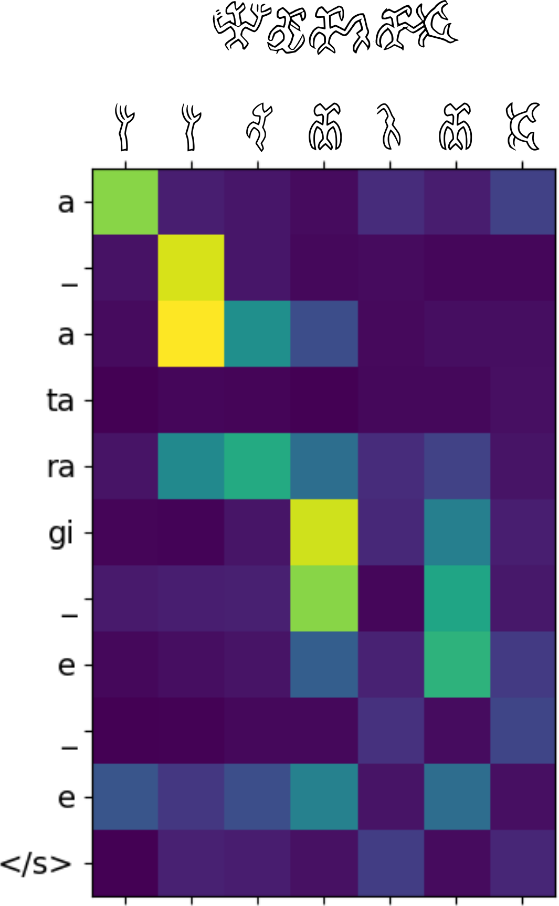

<h1>rongopy</h1>
<h3>Ideas for the decipherment of rongorongo using machine learning in Python</h3>

Jonas Gregorio de Souza 
 

* [Background](#Background)
* [Approaches to decipherment](#Approaches)
* [2023 Update](#Update)

<h2>Background </h2>
<h3>What is rongorongo?</h3>

Rongorongo (henceforth RoR) is an undeciphered glyph system from Easter Island. The very nature of RoR as true writing is debated. In the past, the prevalent view was that the glyphs were a mnemonic device and were unrelated to the specific words of the chants they were meant to recall (Métraux 1957; Routledge 1919). Nowadays, most scholars assume that the system was either logographic, with a few phonetic complements (<a href="https://doi.org/10.3406/jso.1990.2882">Guy 1990,</a> <a href="https://kahualike.manoa.hawaii.edu/rnj/vol20/iss1/9/">2006</a>; <a href="https://www.jstor.org/stable/20706625">Fischer 1995a</a>), or predominantly syllabic, with certain glyphs working as determinatives or logograms (<a href="https://doi.org/10.3406/jso.1996.1995">Pozdniakov 1996</a>; <a href="http://pozdniakov.free.fr/publications/2007_Rapanui_Writing_and_the_Rapanui_Language.pdf">Pozdniakov and Pozdniakov 2007</a>; <a href="https://kahualike.manoa.hawaii.edu/rnj/vol19/iss2/6/">Horley 2005,</a><a href="https://kahualike.manoa.hawaii.edu/rnj/vol21/iss1/7/"> 2007</a>).

The canonical RoR corpus is comprised of texts carved on 20 wooden tablets, one staff, two <i>reimiro</i> (pectoral adornments), one birdman sculpture (<i>tagata manu</i>), and one snuffbox (assembled from an earlier tablet). A bark-cloth fragment has recently been recognized as another genuine inscription (<a href="ps://www.sav.sk/index.php?lang=sk&doc=journal-list&part=article_response_page&journal_article_no=17609">Schoch and Melka 2019</a>). The texts are repetitive, with three tablets (H, P, Q) containing the same text. Certain sequences of glyphs, some of them quite long, appear in multiple artefacts.

The only RoR passage whose meaning is thought to be understood by most scholars is the lunar calendar on tablet <i>Mamari</i> (<a href="https://doi.org/10.3406/jso.1990.2882">Guy 1990</a>; <a href="https://doi.org/10.4000/jso.6314">Horley 2011</a>; but see <a href="https://doi.org/10.15286/jps.121.3.243-274">Davletshin 2012b</a>). Repeated crescent-shaped glyphs are combined with other signs, presumably phonetic complements used to spell the names of the nights.

The antiquity of the system is another point of contention (<a href="http://www.jstor.org/stable/20706648">Langdon and Fischer 1996</a>). Most of the artefacts appear to be recent. Three tablets were carved on European oars, and the only radiocarbon measurement available (for tablet Q, Small St. Petersburg) points to the 19th century (<a href="https://doi.org/10.1002/j.1834-4453.2005.tb00597.x">Orliac 2005</a>). If, however, RoR can be proven earlier than the European encounter and its function as real writing can be ascertained, this would be a remarkable finding - one of the rare cases of independent invention of writing in the world.

On this website and <a href="https://github.com/jgregoriods/rongopy">repository</a>, I offer some thoughts on a machine-learning approach towards decipherment, alongside the data (RoR corpus that can be loaded in Python) and code. This is not another claim to decipherment, as I don't think the results were acceptable, but the method is promising and can perhaps inspire others.

<h2>Approaches to decipherment </h2>

The earliest attempts at decipherment, still in the 19th century, took advantage of the fact that informants were still alive who had presumably been instructed in RoR - or at least heard the tablets being recited (Routledge 1919). Two informants, named Metoro and Ure Vaeiko, provided readings for entire tablets (Thompson 1889; Jaussen 1893). Metoro's readings - apparently just a description of the objects depicted by individual glyphs - formed the basis for Thomas Barthel's interpretation of RoR (Barthel 1958).

Yuri Knorozov, famous for the decipherment of Maya glyphs, was later involved with other Soviet scholars in the study of RoR (Butinov and Knorozov 1957). Their understanding was that RoR was a mixed writing with logograms and phonetic complements, similar to other hieroglyphic systems.

The many publications of Jacques Guy opened several routes to decipherment. Most importantly, we must mention the recognition of potential taxograms or determinatives (<a href="https://kahualike.manoa.hawaii.edu/rnj/vol20/iss1/9/">Guy 2006</a>) and the interpretation of the structure of the lunar calendar in tablet <i>Mamari</i>, including a number of plausible phonetic readings for signs that accompany the moon glyphs (<a href="https://doi.org/10.3406/jso.1990.2882">Guy 1990</a>).

In the 1990s, Steven R. Fischer brought renewed attention to the field with his purported decipherment. Based on similarities with the structure of a cosmogonic chant recited by Ure Vaeiko, Fischer read a series of procreation triads in the Santiago Staff (<a href="https://kahualike.manoa.hawaii.edu/rnj/vol9/iss4/1/">Fischer 1995a</a>) and other tablets (<a href="https://www.jstor.org/stable/20706625">Fischer 1995b</a>). His work, however, was heavily criticized by other RoR scholars (<a href="https://doi.org/10.3406/jso.1998.2041">Guy 1998</a>; <a href="https://doi.org/10.3406/jso.1996.1995">Pozdniakov 1996</a>).

The recent work by the Pozdniakovs (<a href="https://doi.org/10.3406/jso.1996.1995">Pozdniakov 1996</a>; <a href="http://pozdniakov.free.fr/publications/2007_Rapanui_Writing_and_the_Rapanui_Language.pdf">Pozdniakov and Pozdniakov 2007</a>) and Paul Horley (<a href="https://evols.library.manoa.hawaii.edu/items/af73d1dc-60df-4143-ab68-770a56d81d82">2005</a>, <a href="https://evols.library.manoa.hawaii.edu/server/api/core/bitstreams/d68c64ef-12c2-4d79-ae8a-afb56a43c762/content">2007</a>) is focused on simplifying Barthel's catalogue by isolating the basic glyphs in RoR and comparing glyph and Rapanui syllable statistics. Similarly, Albert Davletshin (<a href="https://doi.org/10.4000/jso.6658">Davletshin 2012a</a>, <a href="https://doi.org/10.15286/jps.121.3.243-274">2012b</a>) has been attempting to separate syllabograms and logograms in RoR based on glyph combinatorial properties. Most recently, he propsed some syllabic readings of glyphs based on apparent logogram substitutions and use as phonetic complements (<a href="https://thepolynesiansociety.org/jps/index.php/JPS/article/view/579">Davletshin 2022</a>).

Martyn Harris and Tomi Melka have been moving the field in the direction of machine learning and natural language processing with  <i>n</i>-gram collocation and latent semantic analysis (LSA) (<a href="https://doi.org/10.1080/09296174.2011.556003">Harris and Melka 2011a</a>, <a href="https://doi.org/10.1080/09296174.2011.581850">2011b</a>).

Finally, an updated tracing of the corpus using new recording methods is a priority in recent years (<a href="https://academic.oup.com/dsh/article/37/2/497/6387816">Lastilla et al. 2022</a>; <a href="https://www.rivisteweb.it/doi/10.1418/105968">Valerio et al. 2022</a>). The reference in that regard is Paul Horley's book (<a href="https://rapanuipress.com/producto/rongorongo-2">2021</a>) which, in addition to the publication of updated tracings of the entire corpus, also provides numerous discussions about the glyph catalogue, parallel passages, structured sequences and list entries.

<h2>2023 Update</h2>

This is an update to my previous code (see ga_lstm folder), which used a genetic algorithm scored by an LSTM language model to "brute force" a mapping between glyphs and syllables.

The idea is to use syllable and glyph frequencies, combined with sequence-to-sequence (seq2seq) models, to map the glyphs to the language. Similar approaches have been proposed to decrypt substitution cyphers by encoding both source and target texts to a common space, either using the respective letter/symbol frequencies (<a href="https://aclanthology.org/2021.acl-long.561/">Aldarrab and May 2021</a>) or as recurrent integer sequences (<a href="https://aclanthology.org/2023.findings-eacl.160/">Kambhatla et al. 2023</a>).

<h3>Seq2Seq Model</h3>

Here, I use a selection of short recitations and chants, which most likely represent the genres present in some of the rongorongo texts (<a href="https://www.jstor.org/stable/40454429">Barthel 1960</a>; <a href="https://www.amazon.com/-/es/Olaf-Blixen/dp/B08HH2MZ5Q">Blixen 1979</a>; <a href="https://www.jstor.org/stable/20706594">Fischer 1994</a>). These texts, including the kaikai recitations that accompany string figures, very often preserve fossilised forms of the ancient Rapa Nui language. Assuming that rongorongo represents a logosyllabic writing system, the verses are split into syllables. The syllables are then converted to integer sequences according to the rank of each syllable by order of frequency.

If decipherment was a simple matter of matching glyph and syllable frequencies, the solution would have been found long ago. Unfortunately, frequencies vary considerably depending on the subset of texts that is considered. To account for that, each verse is encoded ten times, each time based on the frequencies calculated from a random sample of verses, similar to the approach of <a href="https://aclanthology.org/2021.acl-long.561/">Aldarrab and May (2021)</a>.

An encoder-decoder model with attention is then trained with the integer sequences (i.e. each sylable encoded as its frequency rank) as sources and the syllable sequences as targets. I use a GRU model with 100 embedding units and 250 hidden units for both the encoder and the decoder (<a href="https://github.com/tensorflow/tensorflow/blob/r1.13/tensorflow/contrib/eager/python/examples/nmt_with_attention/nmt_with_attention.ipynb">the TensorFlow authors 2018</a>).

The model is trained to predict Rapa Nui sentences from integer sequences based on syllable frequencies. Glyph sequences are then encoded in the same way and fed into the model. <i>Please, notice that the "decoded" glyphs are only shown as an example, and the correctness of such decoding is by no means endorsed.</i>

Once trained, the model is tested on sequences of glyphs. I used the parallel passages catalogued by Horley (<a href="https://rapanuipress.com/producto/rongorongo-2">2021</a>). These are numerous mini-texts which are found in various tablets, often in different spellings, with some tablets almost entirely consisting of collations of such passages (<a href="https://doi.org/10.3406/jso.1996.1995">Pozdniakov 1996</a>; <a href="https://rws.xoba.com/ror/">Sproat 2003</a>; <a href="https://evols.library.manoa.hawaii.edu/server/api/core/bitstreams/d68c64ef-12c2-4d79-ae8a-afb56a43c762/content">Horley 2007</a>; among many others). It is possible that they are self-contained texts consisting of short invocations, chants, prayers etc. similar to the content of the selected Rapa Nui texts. Another advantage of using the parallel passages is that the beginning and end of the sequences can be determined - facilitating the analysis of glyph collocations (see below). The glyphs, originally transcribed using Barthel's (1958) catalogue, were converted into the encoding proposed by Horley (<a href="https://rapanuipress.com/producto/rongorongo-2">2021</a>), which, similar to previous proposals, simplifies the numerous ligatures in the catalogue to a set of about 130 basic glyphs. These are encoded according to their frequencies, just like the syllables in the language. Since there are many more glyphs than syllables (partly due to the source materials not distinguishing long vowels or the glottal stop), a maximum rank of 30 was considered, anything lower than that being encoded as 0.

<h3>Results</h3>

Results were not consistent, preventing the assignment of syllabic values to specific glyphs. In fact, the frequency distribution of the glyphs is incompatible with that of the Rapa Nui syllables. While the latter obeys Zipf's law, as expected of natural language, the frequencies of the first and second most frequent glyphs - glyphs  200 and  6, respectively - are not too distant from each other. This is in agreement with the observation that glyph 200 may be a taxogram, frequently omitted in parallel passages and apparently used to connect other glyphs in ligatures (<a href="https://evols.library.manoa.hawaii.edu/server/api/core/bitstreams/61786979-0c4b-47aa-b284-32d112fda7e8/content">Guy 2006</a>). Thus, for the final evaluation, glyph 200 was omitted from the rongorongo sequences.

To assess the viability of the decoding, the predicted texts were evaluated using perplexity based on a bigram model of the Rapa Nui corpus. In addition, the closest matches were sought between predicted sentences and the Rapa Nui verses based on the Levenshtein edit distance (file results.csv). The results were far from acceptable, but still provide some insights. Glyph drawings below are from Paul Horley (<a href="https://rapanuipress.com/producto/rongorongo-2">2021</a>).

Attention weights and prediction from one parallel passage (#11, Ar3) (Horley 2021). <i>Please, notice that the "decoded" glyphs are only shown as an example, and the correctness of such decoding is by no means endorsed.</i>

Some of the readings agree with the position of the glyphs/syllables as starters or enders of sequences. The tables below show the five most frequent glyphs/syllables in the parallel passages and selected Rapa Nui corpus, as well as the five most frequent in the beginning and end of a sequence. As expected, the model often decodes glyph  4, which is the most frequent in the beginning of a sequence, as <i>i</i> or <i>ka</i>. The most frequent glyph,  6, is often decoded as <i>a</i>, as long postulated by Pozdniakov and Pozdniakov (<a href="http://pozdniakov.free.fr/publications/2007_Rapanui_Writing_and_the_Rapanui_Language.pdf">2007</a>). Notice that very different readings were recently proposed by Davletshin (<a href="https://thepolynesiansociety.org/jps/index.php/JPS/article/view/579">2022</a>) based on substitutions and apparent use as phonetic complements, which may provide a more fruitful approach towards decipherment.

<table>
  <tr>
    <th>Glyphs</th>
    <th>Starters</th>
    <th>Enders</th>
  </tr>
  <tr>
    <td> 6</td>
    <td> 4</td>
    <td> 1</td>
  </tr>
  <tr>
    <td> 1</td>
    <td> 600</td>
    <td> 4</td>
  </tr>
  <tr>
    <td> 10</td>
    <td> 10</td>
    <td> 10</td>
  </tr>
  <tr>
    <td> 4</td>
    <td> 6</td>
    <td> 6</td>
  </tr>
  <tr>
    <td> 600</td>
    <td> 1</td>
    <td> 711</td>
  </tr>
</table>

<table>
  <tr>
    <th>Syllables</th>
    <th>Starters</th>
    <th>Enders</th>
  </tr>
  <tr>
    <td>a</td>
    <td>ka</td>
    <td>e</td>
  </tr>
  <tr>
    <td>i</td>
    <td>e</td>
    <td>a</td>
  </tr>
  <tr>
    <td>ka</td>
    <td>ko</td>
    <td>i</td>
  </tr>
  <tr>
    <td>e</td>
    <td>i</td>
    <td>ga</td>
  </tr>
  <tr>
    <td>u</td>
    <td>a</td>
    <td>na</td>
  </tr>
</table>

<h3>Conclusion</h3>

It was not possible to arrive at a viable decoding using the Seq2Seq model, which may be due to the small size of the corpus when compared to similar studies (<a href="https://aclanthology.org/2021.acl-long.561/">Aldarrab and May 2021</a>). The uncertainty about the glyph catalogue, as well as the presence of logograms and determinatives (taxograms) in addition to syllabic glyphs, are also factors that hinder an automated approach to decipherment.

