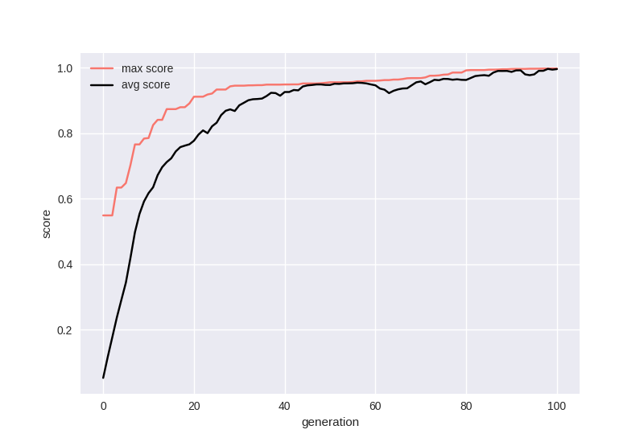

# rongopy
### Ideas for the decipherment of rongorongo using machine learning and genetic algorithms in Python

Jonas Gregorio de Souza<br/>
[](https://orcid.org/0000-0001-6032-4443)<br/>

* [Background](#Background)
* [Approaches to decipherment](#Approaches)
* [Revising the glyph catalogue](#Revising)
* [Data exploration](#Exploration)
* [A machine learning approach to decipherment](#Machine)

## Background <a name="Background"></a>
### What is rongorongo?

<p>Rongorongo (henceforth RoR) is an undeciphered glyph system from Easter Island. The very nature of RoR as true writing is debated. In the past, the prevalent view was that the glyphs were a mnemonic device and were unrelated to the specific words of the chants they were meant to recall (Métraux 1957; Routledge 1919). Nowadays, most scholars assume that the system was either logographic, with a few phonetic complements (<a href="https://doi.org/10.3406/jso.1990.2882">Guy 1990,</a> <a href="https://kahualike.manoa.hawaii.edu/rnj/vol20/iss1/9/">2006</a>; <a href="https://www.jstor.org/stable/20706625">Fischer 1995a</a>), or predominantly syllabic, with certain glyphs working as determinatives or logograms (<a href="https://doi.org/10.3406/jso.1996.1995">Pozdniakov 1996</a>; <a href="http://pozdniakov.free.fr/publications/2007_Rapanui_Writing_and_the_Rapanui_Language.pdf">Pozdniakov and Pozdniakov 2007</a>; <a href="https://kahualike.manoa.hawaii.edu/rnj/vol19/iss2/6/">Horley 2005,</a><a href="https://kahualike.manoa.hawaii.edu/rnj/vol21/iss1/7/"> 2007</a>).</p>

<p>The canonical RoR corpus is comprised of texts carved on 20 wooden tablets, one staff, two <i>reimiro</i> (pectoral adornments), one birdman sculpture (<i>tagata manu</i>), and one snuffbox (assembled from an earlier tablet). A bark-cloth fragment has recently been recognized as another genuine inscription (<a href="ps://www.sav.sk/index.php?lang=sk&doc=journal-list&part=article_response_page&journal_article_no=17609">Schoch and Melka 2019</a>). The texts are repetitive, with three tablets (H, P, Q) containing the same text. Certain sequences of glyphs, some of them quite long, appear in multiple artefacts.<p>
<p>The only RoR passage whose meaning is thought to be understood by most scholars is the lunar calendar on tablet <i>Mamari</i> (<a href="https://doi.org/10.3406/jso.1990.2882">Guy 1990</a>; <a href="https://doi.org/10.4000/jso.6314">Horley 2011</a>; but see <a href="https://doi.org/10.15286/jps.121.3.243-274">Davletshin 2012b</a>). Repeated crescent-shaped glyphs are combined with other signs, presumably phonetic complements used to spell the names of the nights.</p>
<p>The antiquity of the system is another point of contention (<a href="http://www.jstor.org/stable/20706648">Langdon and Fischer 1996</a>). Most of the artefacts appear to be recent. Three tablets were carved on European oars, and the only radiocarbon measurement available (for tablet Q, Small St. Petersburg) points to the 19th century (<a href="https://doi.org/10.1002/j.1834-4453.2005.tb00597.x">Orliac 2005</a>). If, however, RoR can be proven earlier than the European encounter and its function as real writing can be ascertained, this would be a remarkable finding - one of the rare cases of independent invention of writing in the world.</p>
<p>On this website and <a href="https://github.com/jgregoriods/rongopy">repository</a>, I offer some thoughts on a machine-learning approach towards decipherment, alongside the data (RoR corpus that can be loaded in Python) and code. This is not another claim to decipherment, as I don't think the results were satisfactory, but the method is promising and can perhaps inspire others.</p>

## Approaches to decipherment <a name="Approaches"></a>

<p>The earliest attempts at decipherment, still in the 19th century, took advantage of the fact that informants were still alive who had presumably been instructed in RoR - or at least heard the tablets being recited (Routledge 1919). Two informants, named Metoro and Ure Vaeiko, provided readings for entire tablets (Thompson 1889; Jaussen 1893). Metoro's readings - apparently just a description of the objects depicted by individual glyphs - formed the basis for Thomas Barthel's interpretation of RoR (Barthel 1958).</p>
<p>Yuri Knorozov, famous for the decipherment of Maya glyphs, was later involved with other Soviet scholars in the study of RoR (Butinov and Knorozov 1957). Their understanding was that RoR was a mixed writing with logograms and phonetic complements, similar to other hieroglyphic systems.</p>
<p>The many publications of Jacques Guy opened several routes to decipherment. Most importantly, we must mention the recognition of potential taxograms or determinatives (<a href="https://kahualike.manoa.hawaii.edu/rnj/vol20/iss1/9/">Guy 2006</a>) and the interpretation of the structure of the lunar calendar in tablet <i>Mamari</i>, including a number of plausible phonetic readings for signs that accompany the moon glyphs (<a href="https://doi.org/10.3406/jso.1990.2882">Guy 1990</a>).</p>
<p>In the 1990s, Steven R. Fischer brought renewed attention to the field with his purported decipherment. Based on similarities with the structure of a cosmogonic chant recited by Ure Vaeiko, Fischer read a series of procreation triads in the Santiago Staff (<a href="https://kahualike.manoa.hawaii.edu/rnj/vol9/iss4/1/">Fischer 1995a</a>) and other tablets (<a href="https://www.jstor.org/stable/20706625">Fischer 1995b</a>). His work, however, was heavily criticized by other RoR scholars (<a href="https://doi.org/10.3406/jso.1998.2041">Guy 1998</a>; <a href="https://doi.org/10.3406/jso.1996.1995">Pozdniakov 1996</a>).</p>
<p>The recent work by the Pozdniakovs (<a href="https://doi.org/10.3406/jso.1996.1995">Pozdniakov 1996</a>; <a href="http://pozdniakov.free.fr/publications/2007_Rapanui_Writing_and_the_Rapanui_Language.pdf">Pozdniakov and Pozdniakov 2007</a>) and Paul Horley (<a href="https://kahualike.manoa.hawaii.edu/rnj/vol19/iss2/6/">2005</a>, <a href="https://kahualike.manoa.hawaii.edu/rnj/vol21/iss1/7/">2007</a>) is focused on simplifying Barthel's catalogue by isolating the basic glyphs in RoR and comparing glyph and Rapanui syllable statistics. Similarly, Albert Davletshin (<a href="https://doi.org/10.4000/jso.6658">Davletshin 2012a</a>, <a href="https://doi.org/10.15286/jps.121.3.243-274">2012b</a>) has been attempting to separate syllabograms and logograms in RoR based on glyph combinatorial properties.</p>
<p>Finally, Martyn Harris and Tomi Melka have been moving the field in the direction of machine learning and natural language processing with  <i>n</i>-gram collocation and latent semantic analysis (LSA) (<a href="https://doi.org/10.1080/09296174.2011.556003">Harris and Melka 2011a</a>, <a href="https://doi.org/10.1080/09296174.2011.581850">2011b</a>).</p>

## Revising the glyph catalogue <a name="Revising"></a>
<p>A sound statistical analysis of RoR depends on the correct transliteration of the texts. Unfortunately, the system devised by Barthel (1958) exaggerates the quantity of glyphs by assigning different numbers to allographs and ligatures. In fact, a quick experiment showed me that, after differentiating the most obvious allographs and separating the most obvious ligatures (e.g. anthropomorphs and ornitomorphs with various hand shapes), we are left with about 50 glyphs accounting for over 90% of the corpus - a number surprisingly close to the number of Rapanui syllables.</p>
<p>Martha Macri (1996), the Pozdniakovs (<a href="http://pozdniakov.free.fr/publications/2007_Rapanui_Writing_and_the_Rapanui_Language.pdf">2007</a>) and Paul Horley (<a href="https://kahualike.manoa.hawaii.edu/rnj/vol19/iss2/6/">2005</a>) have all attempted to simplify Barthel's catalogue, arriving at pretty similar solutions. Horley offers the most radical restructuring, e.g. considering the anthropomorphic and ornitomorphic glyphs' heads as independent signs. For creating the "simplified" corpus, I mostly adopted the Pozdniakovs' solution, except for the treatment of glyphs like those in the series 420-430, which Pozdniakov (<a href="https://doi.org/10.4000/jso.6371">2011</a>) initially regarded as a ligature of hand glyphs 006 or 010 with anthropomorphic or ornitomorphic glyphs.</p>
<p>In fact, it is unclear how those glyphs should be treated. In a recent paper, Pozdniakov (<a href="http://pozdniakov.free.fr/publications/2016_Correlation_of_graphical_features.pdf">2016</a>) cast doubt on whether glyphs of the series 220/240/320/340 should be considered as independent glyphs rather than allographs of 200/300, based on the observation that leg shapes are not independent of hand shapes.</p>
<p>There are reasons to take that argument one step further and consider all anthropomorphic glyphs as allographs. The parallel passages below are striking:</p>

<p>Other examples can be found in Aa7:Ra3, Br9:Bv3, Bv3:Ra4, Bv8:Sa5, Bv7 and probably many other places.</p>
<p>If anthropomorphic glyphs in standing (200/300), seating in profile (280/380) and seating in frontal view (240/340) position are allographs, should we view ornitomorphic glyphs in the same manner? For example,  should we treat glyphs in the 430/630 series as "profile" versions of the frontal ornitomorphs (400/600)? Pozdniakov (<a href="http://pozdniakov.free.fr/publications/2016_Correlation_of_graphical_features.pdf">2016</a>) seems to hint at that possibility for glyphs in the 430 series, even suggesting that Barthel (1958) probably thought so. Here, I have adopted that view, merging all anthropomorphs and most ornitomorphs (except for those in the 660 series) in the simplified corpus.</p>

## Data exploration <a name="Exploration"></a>
<p>We start by loading the tablets and language corpus.</p>
<p>The following artefacts were retained for the analysis: A, B, C, D, E, G, N, P, R and S. G was selected as inclusive of the text in K, and P was selected as representative of H-P-Q. The Santiago Staff (I) reflects a very particular genre and structure (also present in parts of G-K), and was left out of the analysis for now. The selection can be changed in the <code>config.py</code> file.</p>
<p>The rongorongo corpus is provided as a dictionary with artefacts' names (letters) as keys. Values are themselves dictionaries with each line as key and a string of glyphs as value:</p>

```python
>>> from utils import load_data
>>> from config import TABLET_SUBSET
>>> 
>>> all_tablets = load_data('./tablets/tablets_clean.json')
>>> tablets = {tablet: all_tablets[tablet] for tablet in TABLET_SUBSET}
>>> 
>>> tablets['B']['Br1']
'595-001-050-394-004-002-595-001-050-301-004-002-040-211-091-200-595-002-394-004-002-595-002-050-394-004-002-595-002-050-301-004-002-042-211-091-595-600-050-381-004-002-306-325-430-053-430-017-430-004-002-208-200-002-022-305-074-095-001-000-069'
```

<p>Once a particular set of texts is loaded, basic properties of the glyphs can be explored with the <code>GlyphStats</code> class. For example, the <code>get_percentages()</code> method returns a data frame with the ordered percentages and cumulative percentages of each glyph:</p>

```python
>>> from explore.glyph_stats import GlyphStats
>>> 
>>> glyph_stats = GlyphStats(tablets)
>>> glyph_frequencies = glyph_stats.get_percentages()
>>> glyph_frequencies
    Glyph                 Percent   Cumulative Percent
0     001     0.06461710452766908  0.06461710452766908
1     002     0.03666852990497484  0.10128563443264393
2     004     0.03566238121855785   0.1369480156512018
3     003     0.03476802683063164  0.17171604248183342
4     022     0.02615986584684181  0.19787590832867524
..    ...                     ...                  ...
541   682  0.00011179429849077697   0.9995528228060321
542   555  0.00011179429849077697   0.9996646171045228
543   576  0.00011179429849077697   0.9997764114030135
544   587  0.00011179429849077697   0.9998882057015043
545   635  0.00011179429849077697    0.999999999999995

[546 rows x 3 columns]
```

<p>We see that the top 50 glyphs account for approximately 65% of the texts:</p>

```python
>>> glyph_frequencies.loc[[50]]
   Glyph                Percent  Cumulative Percent
50   711  0.0051425377305757405  0.6471771939631079
```

<p> Let's save a list with the top 50 glyphs to be used later in the genetic algorithm. This can be done with the <code>get_top_n()</code> method:</p>

```python
>>> top_glyphs = glyph_stats.get_top_n(50)
```

<p>Similarly, language properties can be analysed with the <code>LangStats</code> class. The Rapanui language corpus has been compiled from Barthel (<a href="https://www.jstor.org/stable/40454429?origin=JSTOR-pdf">1960</a>), Englert (1948), Campbell (1971), Métraux (1971) and Fedorova (1978) (available <a href="https://starlingdb.org/kozmin/polynesia/rapanui.php">here</a>). These are short songs, lore and recitations most likely to represent the same genera as the rongorongo texts.</p>
<p>Some preprocessing is automatically done to separate the verses into syllables.</p>

```python
>>> from explore.lang_stats import LangStats
>>> 
>>> raw_corpus = load_data('./language/corpus.txt')
>>> lang_stats = LangStats(raw_corpus)
>>> 
>>> corpus = lang_stats.corpus
```

## A machine learning approach to decipherment <a name="Machine"></a>

<p>Given a sufficiently long text written in an unknown script, decipherment is achievable - provided the underlying language and type of writing system are known.</p>
<p>Assuming that RoR is predominantly syllabic, as suggested by the glyph frequencies, one could employ a brute force approach and test different mappings of glyphs to syllables. The problem is one of verifyability - unless an entire text in clear, understandable Rapanui is produced, how to decide between different mappings? Indeed, this seems to be the favourite approach of many pseudo-decipherments, which eventually produce a few meaningful words but have to resort to implausible arguments to interpret longer passages.</p>
<p>How to decide on the plausibility of a deciphered text? Here, I employ a support vector machine (SVM) classifier and a recurrent neural network (RNN) to predict whether a text is viable Rapanui.</p>
<p>Models are trained on a corpus of (1) real Rapanui, and (2) pseudo-Rapanui verses created by encrypting the real verses with a substitution cypher (mapping to different syllables). I originally included two other categories - created by randomly concatenating syllables and by shuffling the syllables of real Rapanui verses. That resulted in models that were more difficult to train, so I left them out for now.</p>
<p>Since there is no separation of words in RoR, all the texts were converted into continuous syllables separated by spaces (to facilitate tokenization). Texts were truncated to a maximum of 50 syllables (longer verses were split).</p>

<p>The first step is to create a labelled corpus with the real and pseudo-Rapanui to train the language models. This is done in the <code>CorpusLabeller</code> class:</p>

```python
>>> corpus_labeller = CorpusLabeller(corpus)
>>> labelled_texts = corpus_labeller.labelled_texts
>>> 
>>> labelled_texts
     index                                               text  label
0      229  ve hi 'i ru ma ha ru ko he 'e ru ru ta 'e ru p...      1
1      296                      hi te ku po ku te ku ku hi te      1
2      343  mi vu ri pe ki ko pu ke ka pi ge pi to go hi k...      1
3      384  ha ti me 'i na ku ti hu gu te ne ve tu me ke t...      1
4      124  ra ga te 'i vi ta 'i na ka 'i ri 'a hi va 'a t...      0
..     ...                                                ...    ...
411      0  ki 'a ki 'a ki 'a ki 'a ta ri ra 'u ku ma ra '...      0
412     60  he ta ho ga no ta pu ku ta ho ga he ki 'a ki '...      0
413    205  ko 'a ta mu te 'a ri ki tu mu 'i ho 'a 'o te m...      0
414    351  hu ku hi gu vo ru 'e hu ko hu ko ro gu pi ku g...      1
415    359  va ni ke no no hu go ho va tu va ma to no mu t...      1
```

<p>Where labels are 0 for real Rapanui and 1 for the pseudo-verses. Notice the data are randomly shuffled.</p>

<p>The absence of word separation is a major drawback that prevents, for example, the application of the model designed by Luo et al. (<a href="http://dx.doi.org/10.18653/v1/P19-1303">2019</a>), which depends on matching cognates at the word level.</p>

## LinearSVC and LSTM
<p>Initially, a Linear Support Vector Classification (SVC) model was trained on the corpus with real Rapanui and the two pseudo datasets using an <i>n</i>-ngram range of 2 to 3 syllables. The classification achieves a validation accuracy above 95%. However, a problem that I found when using LinearSVC with a language like Rapanui (which has a very limited phonological inventory) is that it is very prone to misclassifying random concatenations of syllables that eventually contain Rapanui words, but which don't make sense as a sentence. Increasing the <i>n</i>-gram range did not solve this issue.</p>

```python
>>> svc = LanguageModelSVC(labelled_texts)
>>> X_train, y_train, X_test, y_test = svc.make_training_data(0.1)
>>> svc.train(X_train, y_train, X_test, y_test)
LinearSVC score: 1.0
```

<p>Because the order in which words occur is crucial for deciding whether a sentence is valid Rapanui (beyond the mere frequency of <i>n</i>-grams), a potential solution is to train a Long Short-Term Memory (LSTM) network. The network has an embedding layer of size 32, a bidirectional LSTM layer of size 64, a dropout of 20% and a dense output layer of size 3 (real Rapanui and the two pseudo-corpora) with softmax activation. Other architectures are possible, but out of the ones I tried, this yielded the highest validation accuracy (70-80%).</p>
<p>I used sklearn for the LinearSVC and tensorflow for the LSTM. Models can be loaded from the <code>models</code> folder.</p>

```python
>>> lstm = LanguageModelLSTM(labelled_texts)
>>> X_train, y_train, X_test, y_test = lstm.make_training_data(0.1)
>>> lstm.build(32, 128, 0.2)
>>> lstm.train(X_train, y_train, 0.1, 50)
...
Epoch 50/50
11/11 [==============================] - 0s 22ms/step - loss: 2.1150e-04 - accuracy: 1.0000 - val_loss: 0.1870 - val_accuracy: 0.9737
```

## Genetic algorithm
<p>Every genome in the population is a sequence of syllables to be matched with the top 50 most frequent glyphs.</p>
<p>Because order is meaningful, I experimented with two different crossover methods - ordered crossover (OX1) and edge recombination crossover (ERX). The latter remains in the code, but OX1 was ultimately used due to its resulting in less drastic recombinations. Mutation involves swapping two random syllables.</p>
<p>Every genome (map of glyphs to syllables) is evaluated by decoding the selected RoR corpus and getting the LSTM probability of belonging to the "real Rapanui" class. In essence, the more Rapanui-like the decoded text, the higher the score should be. The text is split when unmapped glyphs are encountered (another solution could be mapping them to OOV), resulting in various lines. Those longer than 10 syllables are scored by the LSTM model, the final score being an average of all decoded lines.</p>
<p>The genetic algorithm was run for 200 generations with a population of 500 genomes, 200 parents, 50 elite genomes and probabilities of crossover and mutation of 0.8 and 0.1 respectively. The graph shows the best (red) and average (black) scores of the population.</p>

```python
>>> ga = GeneticAlgorithm(tablets, lstm, top_glyphs, 500, 200, 50, 0.8, 0.1)
Initializing population...
Done
>>> ga.evolve(100, 10)
Evolving...
Generation 100	Best: 1.00	Avg: 1.00
>>> ga.plot()
```



<p>The best mapping of glyphs to syllables can be accessed in the <code>best_key</code> attribute:</p>

```python
>>> ga.best_key
{'001': "'a", '002': 'ha', '004': 'ta', '003': 'ka', '022': "'i", '006': "'u", '600': "'e", '200': 'te', '005': 'ma', '010': 'mo', '700': 'va', '009': 'ku', '007': "'o", '380': 'vu', '040': 'ne', '008': 'he', '074': 'ho', '050': 'ga', '300': 'ki', '063': 'vi', '430': 'pe', '064': 'no', '020': 'po', '070': 'ti', '065': 'pa', '280': 'ni', '670': 'ra', '095': 'nu', '052': 'ge', '076': 'hu', '060': 've', '062': 'go', '048': 'hi', '522': 'ke', '044': 'pi', '053': 'tu', '067': 'ru', '306': 'pu', '091': 'gi', '061': 'me', '073': 'ro', '400': 'mi', '069': 'na', '381': 'gu', '066': 'vo', '011': 'ri', '059': 'mu', '450': 're', '025': 'ko', '027': 'to'}
```
