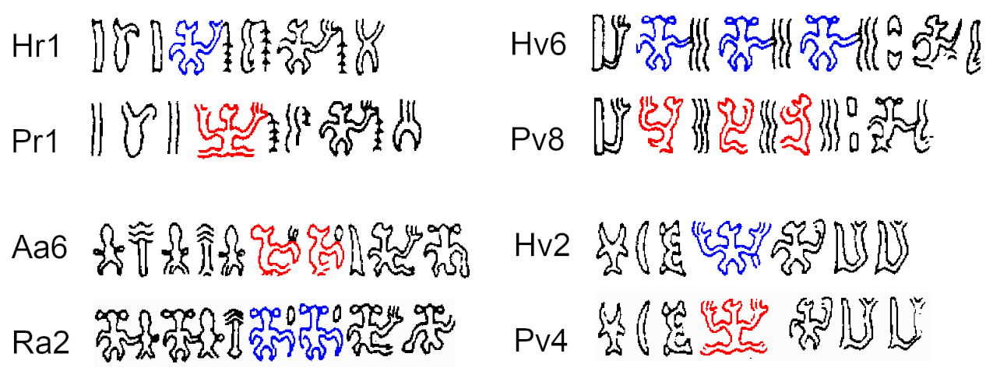
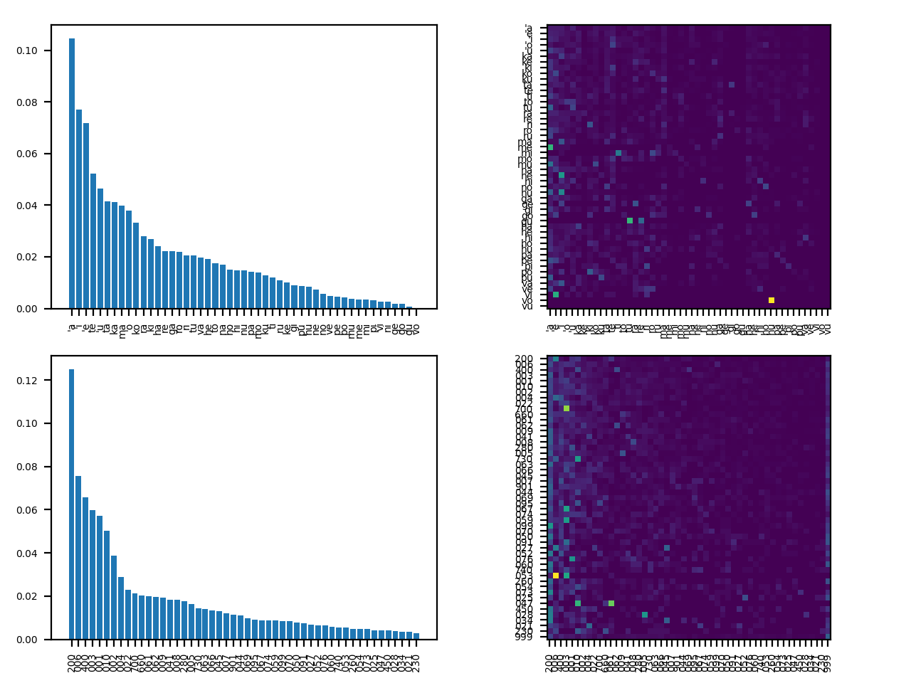
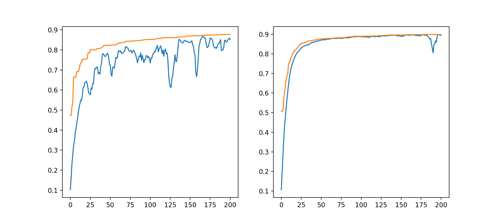
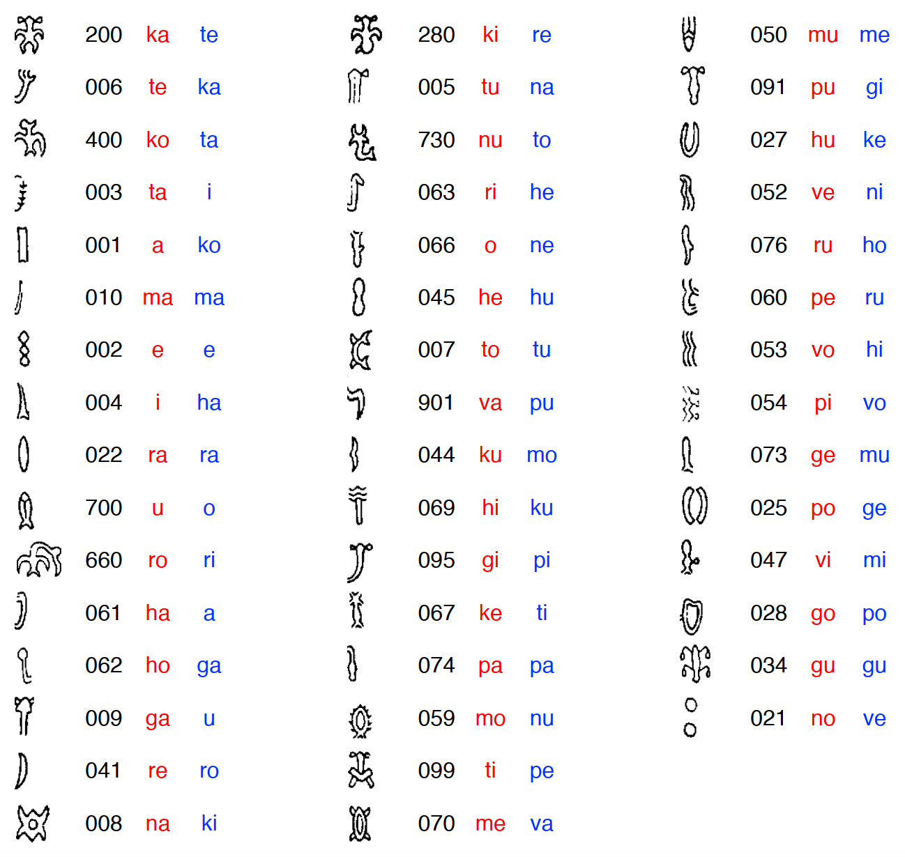

# rongopy
[1. What is rongorongo?](#what-is-rongorongo?)
 
[2. Approaches to decipherment](#approaches-to-decipherment)
 
[3. Revising the glyph catalogue](#revising-the-glyph-catalogue)
 
[4. Basic stats](#basic-stats)
 
[5. A machine learning approach](#a-machine-learning-approach)
 
[6. Results](#results)

## What is rongorongo?

Rongorongo (henceforth RoR) is an undeciphered glyph system from Easter Island. The very nature of RoR as true writing is debated. In the past, the prevalent view was that the glyphs were a mnemonic device and were unrelated to the specific words of the chants they were meant to recall (Métraux 1957; Routledge 1919). Nowadays, most scholars assume that the system was either logographic, with a few phonetic complements (<a href="https://doi.org/10.3406/jso.1990.2882">Guy 1990,</a> <a href="https://kahualike.manoa.hawaii.edu/rnj/vol20/iss1/9/">2006</a>; <a href="https://www.jstor.org/stable/20706625">Fischer 1995a</a>), or predominantly syllabic, with certain glyphs working as determinatives or logograms (<a href="https://doi.org/10.3406/jso.1996.1995">Pozdniakov 1996</a>; <a href="http://pozdniakov.free.fr/publications/2007_Rapanui_Writing_and_the_Rapanui_Language.pdf">Pozdniakov and Pozdniakov 2007</a>; <a href="https://kahualike.manoa.hawaii.edu/rnj/vol19/iss2/6/">Horley 2005,</a><a href="https://kahualike.manoa.hawaii.edu/rnj/vol21/iss1/7/"> 2007</a>).

The canonical RoR corpus is comprised of texts carved on 20 wooden tablets, one staff, two <i>reimiro</i> (pectoral adornments), one birdman sculpture (<i>tagata manu</i>), and one snuffbox (assembled from an earlier tablet). A bark-cloth fragment has recently been recognized as another genuine inscription (<a href="ps://www.sav.sk/index.php?lang=sk&doc=journal-list&part=article_response_page&journal_article_no=17609">Schoch and Melka 2019</a>). The texts are repetitive, with three tablets (H, P, Q) containing the same text. Certain sequences of glyphs, some of them quite long, appear in multiple artefacts.

The only RoR passage whose meaning is thought to be understood by most scholars is the lunar calendar on tablet <i>Mamari</i> (<a href="https://doi.org/10.3406/jso.1990.2882">Guy 1990</a>; <a href="https://doi.org/10.4000/jso.6314">Horley 2011</a>; but see <a href="https://doi.org/10.15286/jps.121.3.243-274">Davletshin 2012b</a>). Repeated crescent-shaped glyphs are combined with other signs, presumably phonetic complements used to spell the names of the nights.

The antiquity of the system is another point of contention (<a href="http://www.jstor.org/stable/20706648">Langdon and Fischer 1996</a>). Most of the artefacts appear to be recent. Three tablets were carved on European oars, and the only radiocarbon measurement available (for tablet Q, Small St. Petersburg) points to the 19th century (<a href="https://doi.org/10.1002/j.1834-4453.2005.tb00597.x">Orliac 2005</a>). If, however, RoR can be proven earlier than the European encounter and its function as real writing can be ascertained, this would be a remarkable finding - one of the rare cases of independent invention of writing in the world.

## Approaches to decipherment

The earliest attempts at decipherment, still in the 19th century, took advantage of the fact that informants were still alive who had presumably been instructed in RoR - or at least heard the tablets being recited (Routledge 1919). Two informants, named Metoro and Ure Vaeiko, provided readings for entire tablets (Thompson 1889; Jaussen 1893). Metoro's readings - apparently just a description of the objects depicted by individual glyphs - formed the basis for Thomas Barthel's interpretation of RoR (Barthel 1958).

Yuri Knorozov, famous for the decipherment of Maya glyphs, was later involved with other Soviet scholars in the study of RoR (Butinov and Knorozov 1957). Their understanding was that RoR was a mixed writing with logograms and phonetic complements, similar to other hieroglyphic systems.

The many publications of Jacques Guy opened several routes to decipherment. Most importantly, we must mention the recognition of potential taxograms or determinatives (<a href="https://kahualike.manoa.hawaii.edu/rnj/vol20/iss1/9/">Guy 2006</a>) and the interpretation of the structure of the lunar calendar in tablet <i>Mamari</i>, including a number of plausible phonetic readings for signs that accompany the moon glyphs (<a href="https://doi.org/10.3406/jso.1990.2882">Guy 1990</a>).

In the 1990s, Steven R. Fischer brought renewed attention to the field with his purported decipherment. Based on similarities with the structure of a cosmogonic chant recited by Ure Vaeiko, Fischer read a series of procreation triads in the Santiago Staff (<a href="https://kahualike.manoa.hawaii.edu/rnj/vol9/iss4/1/">Fischer 1995a</a>) and other tablets (<a href="https://www.jstor.org/stable/20706625">Fischer 1995b</a>). His work, however, was heavily criticized by other RoR scholars (<a href="https://doi.org/10.3406/jso.1998.2041">Guy 1998</a>; <a href="https://doi.org/10.3406/jso.1996.1995">Pozdniakov 1996</a>).

The recent work by the Pozdniakovs (<a href="https://doi.org/10.3406/jso.1996.1995">Pozdniakov 1996</a>; <a href="http://pozdniakov.free.fr/publications/2007_Rapanui_Writing_and_the_Rapanui_Language.pdf">Pozdniakov and Pozdniakov 2007</a>) and Paul Horley (<a href="https://kahualike.manoa.hawaii.edu/rnj/vol19/iss2/6/">2005</a>, <a href="https://kahualike.manoa.hawaii.edu/rnj/vol21/iss1/7/">2007</a>) is focused on simplifying Barthel's catalogue by isolating the basic glyphs in RoR and comparing glyph and Rapanui syllable statistics. Similarly, Albert Davletshin (<a href="https://doi.org/10.4000/jso.6658">Davletshin 2012a</a>, <a href="https://doi.org/10.15286/jps.121.3.243-274">2012b</a>) has been attempting to separate syllabograms and logograms in RoR based on glyph combinatorial properties.

Finally, Martyn Harris and Tomi Melka have been moving the field in the direction of machine learning and natural language processing with  <i>n</i>-gram collocation and latent semantic analysis (LSA) (<a href="https://doi.org/10.1080/09296174.2011.556003">Harris and Melka 2011a</a>, <a href="https://doi.org/10.1080/09296174.2011.581850">2011b</a>).

## Revising the glyph catalogue

A sound statistical analysis of RoR depends on the correct transliteration of the texts. Unfortunately, the system devised by Barthel (1958) exaggerates the quantity of glyphs by assigning different numbers to allographs and ligatures. In fact, a quick experiment showed me that, after differentiating the most obvious allographs and separating the most obvious ligatures (e.g. anthropomorphs and ornitomorphs with various hand shapes), we are left with about 50 glyphs accounting for over 90% of the corpus - a number surprisingly close to the number of Rapanui syllables.

Martha Macri (1996), the Pozdniakovs (<a href="http://pozdniakov.free.fr/publications/2007_Rapanui_Writing_and_the_Rapanui_Language.pdf">2007</a>) and Paul Horley (<a href="https://kahualike.manoa.hawaii.edu/rnj/vol19/iss2/6/">2005</a>) have all attempted to simplify Barthel's catalogue, arriving at pretty similar solutions. Horley offers the most radical restructuring, e.g. considering the anthropomorphic and ornitomorphic glyphs' heads as independent signs. For creating the "simplified" corpus, I mostly adopted the Pozdniakovs' solution, except for the treatment of glyphs like those in the series 420-430, which Pozdniakov (<a href="https://doi.org/10.4000/jso.6371">2011</a>) initially regarded as a ligature of hand glyphs 006 or 010 with anthropomorphic or ornitomorphic glyphs.

In fact, it is unclear how those glyphs should be treated. In a recent paper, Pozdniakov (<a href="http://pozdniakov.free.fr/publications/2016_Correlation_of_graphical_features.pdf">2016</a>) cast doubt on whether glyphs of the series 220/240/320/340 should be considered as independent glyphs rather than allographs of 200/300, based on the observation that leg shapes are not independent of hand shapes.

There are reasons to take that argument one step further and consider all anthropomorphic glyphs as allographs. The parallel passages below are striking:

Other examples can be found in Aa7:Ra3, Br9:Bv3, Bv3:Ra4, Bv8:Sa5, Bv7 and probably many other places.

If anthropomorphic glyphs in standing (200/300), seating in profile (280/380) and seating in frontal view (240/340) position are allographs, should we view ornitomorphic glyphs in the same manner? For example,  should we treat glyphs in the 430/630 series as "profile" versions of the frontal ornitomorphs (400/600)? Pozdniakov (<a href="http://pozdniakov.free.fr/publications/2016_Correlation_of_graphical_features.pdf">2016</a>) seems to hint at that possibility for glyphs in the 430 series, even suggesting that Barthel (1958) probably thought so. Here, I have adopted that view, merging all anthropomorphs and most ornitomorphs (except for those in the 660 series) in the "simplified" corpus.

## Data

The following artefacts were retained for the analysis: A, B, C, D, E, G, N, P, R and S. G was selected as inclusive of the text in K, and P was selected as representative of H-P-Q. The Santiago Staff (I) reflects a very particular genre and structure (also present in parts of G-K), and was left out of the analysis for now.

The corpus is provided as a dictionary with artefacts' names (letters) as keys. Values are themselves dictionaries with each line as key and a string of glyphs separated by a dash as value:

<pre><code>from tablets import tablets, tablets_clean, tablets_simple

tablets['B']['Br1']
'595-1-50.394s-4-2-595.1-50-301s-4-2-40-211-91-200-595.2-394-4t-2-595.2-50-394-4t-2-595.2-50-301s.4-2-211s:42-91-595s-600-50-381-4-2-306-325-430-53-430-17-430-4-2-208-200-2-22-305.74f-95-1-?-69*'</pre></code>

## Basic stats

## A machine learning approach

Given a sufficiently long text written in an unknown script, decipherment is achievable - provided the underlying language and type of writing system are known.

Assuming that RoR is predominantly syllabic, as suggested by the glyph frequencies, one could employ a brute force approach and test different mappings of glyphs to syllables. The problem is one of verifyability - unless an entire text in clear, understandable Rapanui is produced, how to decide between different mappings? Indeed, this seems to be the favourite approach of many pseudo-decipherments, which eventually produce a few meaningful words but have to resort to implausible arguments to interpret longer passages.

How to decide on the plausibility of a deciphered text? Here, I employ a support vector machine (SVM) classifier and a recurrent neural network (RNN) to predict whether a text is viable Rapanui. I was inspired by Avi Banerjee's treatment of a similar problem - the <a href="https://github.com/CanonManF22/theZodiacKiller">Zodiac killer's cypher</a>.

Models are trained on a corpus of:

<ul>
<li>real Rapanui songs and poetry, assumed to be the genres most likely present in RoR;</li>
<li>pseudo-Rapanui verses created by randomly concatenating syllables; </li>
<li>pseudo-Rapanui verses created by encrypting the real verses with a substitution cypher (mapping to different syllables).</li>
</ul>

I originally included a fourth category created by shuffling the syllables of real Rapanui verses, but that somehow resulted in models that were difficult to train, so I left it out for now.

Since there is no separation of words in RoR, all the texts were converted into continuous syllables separated by spaces (just to facilitate tokenization). Texts were truncated to a maximum of 50 syllables (longer verses were split). In the case of the LSTM, preprocessing also involved padding to 50 tokens.

The absence of word separation is a major drawback that prevents, for example, the application of the model designed by Luo et al. (<a href="http://dx.doi.org/10.18653/v1/P19-1303">2019</a>), which depends on matching cognates at the word level.

### LinearSVC and LSTM

Initially, a Linear Support Vector Classification (SVC) model was trained on the corpus with real Rapanui and the two pseudo datasets using an <i>n</i>-ngram range of 2 to 3 syllables. The classification achieves a validation accuracy above 95%. However, a problem that I found when using LinearSVC with a language like Rapanui (which has a very limited phonological inventory) is that it is very prone to misclassifying random concatenations of syllables that eventually contain Rapanui words, but which don't make sense as a sentence. Increasing the <i>n</i>-gram range did not solve this issue.

Because the order in which words occur is crucial for deciding whether a sentence is valid Rapanui (beyond the mere frequency of <i>n</i>-grams), a potential solution is to train a Long Short-Term Memory (LSTM) network. The network has an embedding layer of size 32, a bidirectional LSTM layer of size 64, a dropout of 20% and a dense output layer of size 3 (real Rapanui and the two pseudo-corpora) with softmax activation. Other architectures are possible, but out of the ones I tried, this yielded the highest validation accuracy (70-80%).

I used sklearn for the LinearSVC and tensorflow for the LSTM. Models can be loaded from the <code>models</code> folder.

### Genetic algorithm

Every genome in the population is a sequence of syllables to be matched with the top 50 most frequent glyphs (ordered). I tested two methods: (1) initializing every genome to a different, random sequence, and (2) initializing every genome with the same sequence - ordered by the actual Rapanui syllable frequencies. I thought the latter could speed up the process, as a mapping that resulted in too different a syllable frequency from the actual language should score pretty low anyway.

Because order is meaningful, I experimented with two different crossover methods - ordered crossover (OX1) and edge recombination crossover (ERX). Mutation involves swapping two random syllables. Originally, when initializing genomes based on the Rapanui syllable frequencies, I thought it was a good idea to only swap the syllables in immediate vicinity - but since OX1 and ERX were doing something similar, I reserved mutations for more drastic changes.

Every genome (map of glyphs to syllables) is evaluated by decoding the selected RoR corpus and getting a mean of the scores of the LSTM and LinearSVC on the decoded text. In essence, the more Rapanui-like the decoded text, the higher the score should be. The text is split when unmapped glyphs are encountered (another solution could be mapping them to OOV), resulting in various lines. Those longer than 10 syllables are scored by the LSTM/LinearSVC, the final score of each model being an average of all decoded lines. There certainly are better procedures to get the fitness of a decoded text - this was just a quick solution.

The genetic algorithm was run for 200 generations with a population of 500 genomes, 200 parents, 50 elite genomes and probabilities of crossover and mutation of 0.8 and 0.1 respectively. The graphs below show the maximum (orange) and average (blue) scores of the population (randomly initialized) when using ERX (left) and OX1 (right). One can see that the latter results in less drastic recombination, and thus in lower diversity. Maximum scores reach nearly 90% in both cases.

## Results

I was astonished to find that, even when all genomes are randomly initialized, the final keys of the best-performing models are similar. The following values are consistently selected by the top 10 best-performing (and non-identical) genomes of each run (among a total of 4 runs using a combination of genomes initialized by frequency vs. randomly and crossovers by ERX vs. OX1):

Interestingly, some of those values have been proposed before. For example, readings of 200 as <i>te</i> and 002 as <i>a</i> have been suggested by Horley (<a href="https://kahualike.manoa.hawaii.edu/rnj/vol19/iss2/6/">2005</a>) - although he saw the latter glyph as an allograph for the former's head (forming a frequent ligature that could be read as <i>tea</i>). The reading of 400 as <i>ta</i>, perhaps from the first syllable of <i>tavake</i> (sea bird), was proposed long ago by Guy (<a href="https://doi.org/10.3406/jso.1990.2882">1990</a>) based on the supposed spelling of one of the nights' names in the Mamari calendar.

## References

Barthel, Thomas. 1958. <i>Grundlagen zur Entzifferung der Osterinselschrift.</i> Hamburg: Cram, de Gruyter & Co.

Butinov, Nikolai A. and Yuri Knorozov. 1957. Preliminary Report on the Study of the Written Language of Easter Island. <i>Journal of the Polynesian Society</i> 66 (1): 5–17.

Davletshin, Albert. 2012a. <a href="https://doi.org/10.4000/jso.6658">Name in the Kohau Rongorongo script (Easter Island).</a> <i>Journal de la Société des Océanistes</i> 134: 95-110.

Davletshin, Albert. 2012b. <a href="https://doi.org/10.15286/jps.121.3.243-274">Numerals and Phonetic Complements in the Kohau Rongorongo Script of Easter Island.</a> <i>Journal of The Polynesian Society</i> 121: 243-274.

Fischer, Steven R. 1995a. <a href="https://www.jstor.org/stable/20706625">Preliminary evidence for cosmogonic texts in Rapanui's Rongorongo inscriptions.</a> <i>The Journal of the Polynesian Society</i> 104 (3): 303–321.

Fischer, Steven R. 1995b. <a href="https://kahualike.manoa.hawaii.edu/rnj/vol9/iss4/1/">Further Evidence for Cosmogonic Texts in the Rongorongo Inscriptions of Easter Island.</a> <i>Rapa Nui Journal</i> 9 (4): 1.

Guy Jacques B. M. 1990. <a href="https://doi.org/10.3406/jso.1990.2882">The lunar calendar of Tablet Mamari.</a> <i>Journal de la Société des océanistes</i> 91: 135-149.

Guy, Jacques B. M. 1998. <a href="https://doi.org/10.3406/jso.1998.2041">Un prétendu déchiffrement des tablettes de l'île de Pâques.</a> <i>Journal de la Société des Océanistes</i> 106: 57-63.

Guy, Jacques B. M. 2006. <a href="https://kahualike.manoa.hawaii.edu/rnj/vol20/iss1/9/">General Properties of the Rongorongo Writing.</a> <i>Rapa Nui Journal</i> 20 (1).

Harris, Martyn and Tomi S. Melka. 2011a. <a href="https://doi.org/10.1080/09296174.2011.556003">The Rongorongo Script: On a Listed Sequence in the Recto of Tablet “Mamari”.</a> <i>Journal of Quantitative Linguistics</i> 18(2): 122-173.

Harris, Martyn and Tomi S. Melka. 2011b. <a href="https://doi.org/10.1080/09296174.2011.581850">The Rongorongo Script: On a Listed Sequence in the Recto of Tablet “Mamari”. Part II.</a> <i>Journal of Quantitative Linguistics</i> 18(3): 234-273.

Horley, Paul. 2005. <a href="https://kahualike.manoa.hawaii.edu/rnj/vol19/iss2/6/">Allographic Variations and Statistical Analysis of the Rongorongo Script.</a> Rapa Nui Journal 19 (2).

Horley, Paul. 2007. <a href="https://kahualike.manoa.hawaii.edu/rnj/vol21/iss1/7/">Structural Analysis of Rongorongo Inscriptions.</a> Rapa Nui Journal 21 (1).

Horley, Paul. 2011. <a href="https://doi.org/10.4000/jso.6314">Lunar calendar in rongorongo texts and rock art of Easter Island.</a> <i>Journal de la Société des Océanistes</i> 132: 17-38.

Jaussen, Florentine. 1893. <i>L'île de Pâques: Historique, Écriture et Répertoire des signes des tablettes ou bois d'hibiscus intelligents</i>. Paris: Ernest Leraux.

Langdon, Robert, and Steven Roger Fischer. 1996. <a href="http://www.jstor.org/stable/20706648">Easter Island's 'Deed of Cession' of 1770 and the origin of its rongorongo script.</a> <i>The Journal of the Polynesian Society</i> 105 (1): 109-124.

Luo, Jiaming; Cao, Yuan; Barzilay, Regina. 2019. <a href="http://dx.doi.org/10.18653/v1/P19-1303">Neural Decipherment via Minimum-Cost Flow: from Ugaritic to Linear B.</a> <i>Proceedings of the 57th Annual Meeting of the Association for Computational Linguistics</i>, pp. 3146–3155. Florence, Italy.

Macri, Martha. 1996. Rongorongo of Easter Island In Peter T. Daniels and William Bright (eds), <i>The World’s writing systems.</i> Oxford, Oxford University Press, pp. 183-188.

Métraux, Alfred. 1940. <i>Ethnology of Easter Island</i>. Honolulu: Bishop Museum.

Orliac, Catherine. 2005. <a href="https://doi.org/10.1002/j.1834-4453.2005.tb00597.x">The Rongorongo tablets from Easter Island: botanical identification and 14C dating.</a> <i>Archaeology in Oceania</i> 40: 115-119.

Pozdniakov, Konstantin. 1996. <a href="https://doi.org/10.3406/jso.1996.1995">Les bases du déchiffrement de l'écriture de l'île de Pâques.</a> <i>Journal de la Société des océanistes</i> 103: 289-303.

Pozdniakov, Konstantin; Igor Pozdniakov. 2007. <a href="http://pozdniakov.free.fr/publications/2007_Rapanui_Writing_and_the_Rapanui_Language.pdf">Rapanui Writing and the Rapanui Language: Preliminary Results of a Statistical Analysis.</a> <i>Forum for Anthropology and Culture</i> 3: 3–36.

Pozdniakov, Konstantin. 2011. <a href="https://doi.org/10.4000/jso.6371">Tablet Keiti and calendar-like structures in Rapanui script.</a> <i>Journal de la Société des Océanistes</i> 132: 39-74.

Routledge, Katherine. 1919. <i>The Mystery of Easter Island: The story of an expedition</i>. London: Hazell, Watson and Viney.

Schoch, R. and Melka, T. 2019. <a href="https://www.sav.sk/index.php?lang=sk&doc=journal-list&part=article_response_page&journal_article_no=17609">The raŋitoki (rangitoki) bark-cloth piece: a newly recognized rongorongo fragment from Easter Island.</a> <i>Asian and African Studies</i> 28 (2): 113-148.

Thomson, William J. 1889. <i>Te Pito Te Henua, or Easter Island.</i> Report of the United States National Museum for the year ending June 30, 1889.